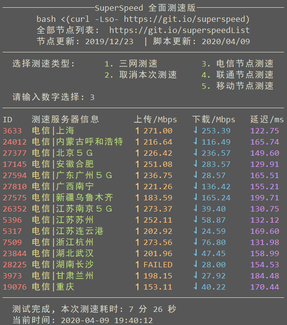

## SpeedTest.sh#######

在Linux VPS上测试网络连接速度，使用全国三大运营商的测速节点进行全面测速。
包括中国大陆地区电信、联通、移动节点。

## 使用方法
```
bash <(curl -Lso- https://git.io/SpeedTest)
```

## 节点列表
[查看全部节点列表（更新日期：2021/08/18）](https://git.io/SpeedTestList) 

## 截图


---
使用 [ookla](https://bintray.com/ookla/download/download_file?file_path=ookla-speedtest-1.0.0-x86_64-linux.tgz) 提供的测速程序

